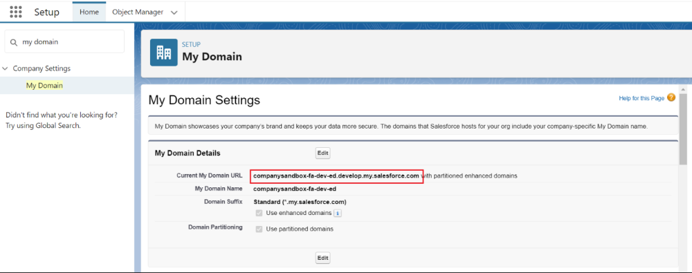
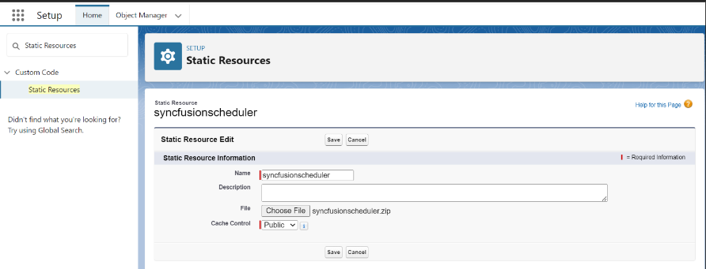
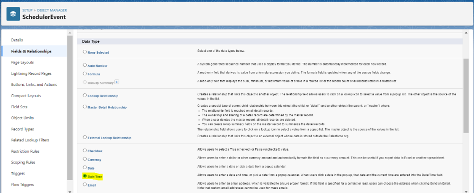

This topic provides you with a detailed step-by-step guide on how to seamlessly integrate the EJ2 Scheduler component into Salesforce. By integrating it into Salesforce, you can enhance your productivity and streamline your scheduling processes. So, let's dive into the integration process and unlock the full potential of the EJ2 Scheduler component within Salesforce.

## Prerequisites

Before we get started, make sure you have the following prerequisites need to be installed

* [Salesforce CLI](https://developer.salesforce.com/tools/salesforcecli)

## Configuring salesforce 

To begin the integration process, we need to configure Salesforce by following these steps.

1. [Sign up](https://developer.salesforce.com/signup) with salesforce developer account, if you don’t have salesforce account, sign up for one to access the necessary tools and resources for integration.

2. [Log in](https://login.salesforce.com/) with salesforce account. 

3.After successful login, search for Dev Hub in the quick find search box and select Dev Hub. In the Dev Hub setup tab, ensure that the Enable Dev Hub option is enabled. If it's not enabled, enable it to proceed further.


## Creating a salesforce project

Now that we have Salesforce configured, let's create a [Salesforce project](https://developer.salesforce.com/docs/atlas.en-us.sfdx_dev.meta/sfdx_dev/sfdx_dev_intro.htm) for our integration. 

1. In your preferred location, create a base directory for your Salesforce project. For example, you can create a directory named salesforceApp using the following command:

```
mkdir salesforceApp 
```

2. Navigate to the base directory you created in the previous step and generate a Salesforce DX project using the following CLI command.

```
sfdx project:generate -n scheduler-salesforce-app 
```


## Authorization of salesforce project 

Before proceeding further, we need to authorize our Salesforce project by following these steps. 

1. Run the following command to authorize your Salesforce project with your Salesforce account in the browser.

```
sfdx org:login:web -d 
```


2. Open the sfdx-project.json file located in salesforceApp/scheduler-salesforce-app and update the sfdcLoginUrl with the domain URL of your Salesforce account as shown in image (fig 2). You can obtain the domain URL from the My Domain setup tab in Salesforce as shown in image (fig 1). 

fig 1


fig 2


## Create scratch organization 

To facilitate development and testing, we will create a scratch organization using the following steps. 

1. Run the following command to create a new scratch organization, which will provide a fresh Salesforce environment for development and testing with organization id and username as link below image.

```
sfdx org:create:scratch -f config/project-scratch-def.json 
```


## Adding static resources 

To integrate the Syncfusion scripts and styles as static resource files within Salesforce, follow these steps.  
 
1. Use the following command to open the scratch project in the browser

```
sfdx org:open -o <stratch org user name> 
```

Replace <scratch org username> with the username of your scratch organization, which was generated during the scratch organization creation process.  
 
2. In the Salesforce setup menu, search for Static Resources and click on New in the static resources tab. 


3. Load the Syncfusion scripts and styles as static files in a zip format, which you can obtain from the [CRG](https://crg.syncfusion.com/).

4. In the static resource tab, provide a name for the static resource files, upload the zip file, and change the cache control to Public. Click Save to add the static resources to your Salesforce project.



## Adding CSP trusted sites 

To ensure seamless integration and prevent content security policy issues, follow these steps. 

1. In the Salesforce setup menu, search for CSP Trusted Sites and click on New Trusted Site.


2. Enter the trusted site name and URL. For example, if the Syncfusion static styles refer to https://fonts.googleapis.com, enter that URL as the trusted site URL.  
 
3. Enable the following options to bypass the CSP issues and Click "Save" to apply the changes. 
 
    * Allow site for font-src 
    * Allow site for style-src 


## Creating data model for appointment 

To begin, navigate to the Object Manager in Salesforce and select Create followed by Custom Object.


In the custom object section, enter a meaningful label for your custom object. For this example, let's name it SchedulerEvent. Once done, click Save to create the custom object. 


## Defining fields and relationships 

let's configure the fields and relationships for the SchedulerEvent object. To do so Click on New to create a new field. 


1. Setting the Data Type for StartTime. Choose DateTime as the data type for the StartTime field. This field will store the starting time of each appointment.



2. Provide a clear label for the StartTime field and click Next. Once you've reviewed the settings, click Save & New to proceed.


3. Repeat the same steps as above to create the EndTime field, which will store the ending time of each appointment. Creating the EndTime Field. Once you've reviewed the settings, click Save & New to proceed.


4. Choose Checkbox as the data type for the IsAllDay field. This field will be marked when an appointment is scheduled for the entire day. 


5. Assign an appropriate label, such as IsAllDay, to the checkbox field. Click Next to review the settings and then click Save & New to proceed. 


6. Choose Text as the data type for the Location/Recurrence Rule/Recurrence Id /Recurrence Exception field to store the location field and recurrence rule for each appointment as shown in the image respectively. Click Next to review the settings and then click Save to proceed. 


7. Based on your specific requirements, you can add more fields to the SchedulerEvent object by following the same steps outlined above.


## Creating a lightning web component 

To integrate the EJ2 Scheduler into your Salesforce project, we will create a [Lightning web component](https://developer.salesforce.com/docs/platform/lwc/guide/get-started-introduction.html). Follow these steps. 

1. In your Salesforce project, run the following command to generate a Lightning web component named scheduler.

```
sfdx lightning:generate:component --type lwc -n scheduler -d force-app/main/default/lwc 
```


2. Open the scheduler.js-meta.xml file located in "force-app/main/default/lwc/scheduler" and modify the component definition to expose it in the Lightning App Builder. Here's an example of the modified file. 

```force-app/main/default/lwc/scheduler/scheduler.js-meta.xml
<?xml version="1.0" encoding="UTF-8"?> 
<LightningComponentBundle xmlns="http://soap.sforce.com/2006/04/metadata"> 
    <apiVersion>57.0</apiVersion> 
    <isExposed>true</isExposed> 
    <targets> 
        <target>lightning__AppPage</target> 
    </targets> 
    <targetConfigs> 
        <targetConfig targets="lightning__AppPage"> 
            <property name="height" label="Height" type="Integer" default="800" /> 
        </targetConfig> 
    </targetConfigs> 
</LightningComponentBundle> 
```

3. Open the scheduler.html file located in "force-app/main/default/lwc/scheduler" and add an element with a class name to append the Syncfusion scheduler. Here's an example of the modified file.
 
```force-app/main/default/lwc/scheduler/scheduler.html
<template> 
    <div class="syncfusionscheduler" lwc:dom="manual" style='width: 100%;'></div> 
</template> 
```

4. Open the scheduler.js file located in "force-app/main/default/lwc/scheduler" and implement the scheduler code in renderedCallback function. The static scripts and styles are loaded using the loadScript and loadStyle imports. Here's an example of the modified file.

```force-app/main/default/lwc/scheduler/scheduler.js
import { LightningElement, api } from 'lwc'; 
import { ShowToastEvent } from "lightning/platformShowToastEvent"; 
import { loadStyle, loadScript } from "lightning/platformResourceLoader"; 
import { createRecord, updateRecord, deleteRecord } from "lightning/uiRecordApi"; 
// Static resources 
import schedulerFiles from "@salesforce/resourceUrl/syncfusionscheduler"; 

// Controllers 
import getEvents from "@salesforce/apex/SchedulerData.getEvents";
function getEventsData(eventData) { 
    const data = eventData.events.map((a) => ({ 
        Id: a.Id, 
        Subject: a.Name, 
        Location: a.Location__c, 
        StartTime: a.Start_Time__c, 
        EndTime: a.End_Time__c, 
        IsAllDay: a.IsAllDay__c, 
        RecurrenceRule: a.RecurrenceRule__c, 
        RecurrenceID: a.Recurrence_Id__c, 
        RecurrenceException: a.RecurrenceException__c 
    })); 
    return data; 
} 

export default class Scheduler extends LightningElement { 
    static delegatesFocus = true;   
    @api height; 
    schedulerInitialized = false;  
    renderedCallback() { 
        if (this.schedulerInitialized) { 
            return; 
        } 
        this.schedulerInitialized = true;  
        Promise.all([ 
            loadScript(this, schedulerFiles + "/syncscheduler.js"), 
            loadStyle(this, schedulerFiles + "/syncscheduler.css") 
        ]) 
            .then(() => { 
                this.initializeUI(); 
            }) 
            .catch((error) => { 
                this.dispatchEvent( 
                    new ShowToastEvent({ 
                        title: "Error loading scheduler", 
                        message: error.message, 
                        variant: "error" 
                    }) 
                ); 
            }); 
    } 
    initializeUI() { 
        const root = this.template.querySelector(".syncfusionscheduler"); 
        root.style.height = this.height + "px"; 
        const scheduleOptions = { 
            height: this.height + "px", 
            selectedDate: new Date(), 
            actionComplete: function (args) { 
                //To perform CRUD in salesforce backend 
                if (args.addedRecords && args.addedRecords.length > 0) { 
                    var data = args.addedRecords[0]; 
                    var insert = { 
                        apiName: "SchedulerEvent__c", 
                        fields: { 
                            Name: data.Subject, 
                            Location__c: data.Location, 
                            Start_Time__c: data.StartTime, 
                            End_Time__c: data.EndTime, 
                            IsAllDay__c: data.IsAllDay, 
                            RecurrenceRule__c: data.RecurrenceRule, 
                            Recurrence_Id__c: data.RecurrenceID, 
                            RecurrenceException__c: data.RecurrenceException 
                        } 
                    }; 
                    createRecord(insert).then((res) => { 
                        if (scheduleObj) 
                        { 
                            scheduleObj.eventSettings.dataSource[scheduleObj.eventSettings.dataSource.length - 1].Id = res.id; 
                            scheduleObj.refreshEvents(); 
                        } 
                        return { tid: res.id, ...res }; 
                    }); 
                } 
                if (args.changedRecords && args.changedRecords.length > 0) { 
                    var data = args.changedRecords[0]; 
                    var update = { 
                        fields: { 
                            Id: data.Id, 
                            Name: data.Subject, 
                            Location__c: data.Location, 
                            Start_Time__c: data.StartTime, 
                            End_Time__c: data.EndTime, 
                            IsAllDay__c: data.IsAllDay, 
                            RecurrenceRule__c: data.RecurrenceRule, 
                            RecurrenceException__c: data.RecurrenceException, 
                            Recurrence_Id__c: data.RecurrenceID 
                        } 
                    }; 
                    updateRecord(update).then(() => ({})); 
                } 
                if (args.deletedRecords && args.deletedRecords.length > 0) { 
                    args.deletedRecords.forEach(event => { 
                        deleteRecord(event.Id).then(() => ({})); 
                    }); 
                } 
            } 
        }; 
        const scheduleObj = new ej.schedule.Schedule(scheduleOptions, root); 
        getEvents().then((data) => { 
            const eventData = getEventsData(data); 
            scheduleObj.eventSettings.dataSource = eventData; 
            scheduleObj.dataBind(); 
        }); 
    } 
} 
```

## Creating apex class 

Apex class that facilitates smooth interactions between your Lightning component and the data model. By following these steps, you will be able to fetch and manipulate data from the SchedulerEvent custom object effortlessly. 

Use the following command to create Apex class with the name SchedulerData. 

```
sfdx apex:generate:class -n SchedulerData -d force-app/main/default/classes	 
```


Open the SchedulerData.cls file located in "force-app/main/default/classes/SchedulerData.cls". 
This will fetch the event data from salesforce backend. Here's an example of the modified file. 

```force-app/main/default/classes/SchedulerData.cls
public with sharing class SchedulerData { 
    @RemoteAction 
    @AuraEnabled(cacheable=true) 
    public static Map<String, Object> getEvents() {  
        // fetching the Records via SOQL 
        List<SchedulerEvent__c> Events = new List<SchedulerEvent__c>(); 
        Events = [SELECT Id, Name, Start_Time__c, End_Time__c, IsAllDay__c, 
            Location__c, RecurrenceRule__c, Recurrence_Id__c, RecurrenceException__c FROM SchedulerEvent__c];
        Map<String, Object> result = new Map<String, Object>{'events' => Events }; 
        return result; 
   } 
} 
```

## Pull scratch organization 

To retrieve the changes made in the scratch organization and sync them with your local Salesforce project, use the following command. 

```
sfdx project:retrieve:start -o <scratch org use name> 
```

Replace <scratch org username> with the username of your scratch organization.


## Push scratch organization 

To push the changes made in your local Salesforce project to the scratch organization, use the following command. 

```
sfdx project:deploy:start -o <scratch org use name> 
```

Replace <scratch org username> with the username of your scratch organization.


## Creating lightning page 

To display the EJ2 Scheduler on a Lightning page, follow these steps. 

1. In your scratch organization, search for Lightning App Builder in the quick find setup, select Lightning App Builder and click New. 


2. Choose App Page and click Next. 


3. Provide a label name for the app page and click Next. For example, here you can name it SyncfusionScheduler. 


4. Choose One Region and click Finish. 


5. In the Lightning App Builder, under the Add Components Here section, drag and drop the scheduler component. The scheduler will be 
rendered inside the content body. Click Save to activate the custom component. 


6. Activate the custom component with name SyncfusionScheduler and click the Save. 


## Launching scheduler in home page 

To access the integrated EJ2 Scheduler on the home page, follow these steps. 

1. Click on the app launcher icon in Salesforce. 
2. Search for SyncfusionScheduler, which was registered earlier in the Lightning App Builder.


3. Click on the SyncfusionScheduler app, and the scheduler will load on the home page.


You can check out the complete working example of this EJ2 Scheduler integration into salesforce on this [GitHub repository](https://github.com/SyncfusionExamples/salesforce-integration-in-ej2-javascript-scheduler) as follows.

This topic has provided a detailed step-by-step guide on how to configure Salesforce, create a Salesforce project, authorize it, add static resources, create a Lightning web component, and display the scheduler on a Lightning page. By following these instructions, you can integrate the EJ2 Scheduler to efficiently manage your events and appointments within Salesforce. 
